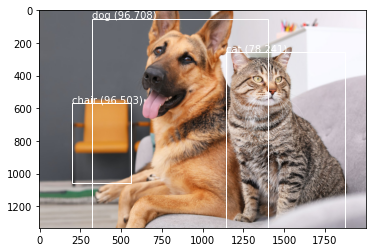

## 

# You Only Look Once Algorithm 

You will find here the elements used in a group project to implement the [YOLOv3 algorithm](https://youtu.be/WP4F6aK1Ft8).  
The algorithm can detect, identify and delimit a wide range of 80 objects on which it was trained and on any image sizes.
Here is an exemple of an implementation we made :  

If you want to run the program with your own pictures, first pull this repository and then dowload the associated [weights](https://pjreddie.com/media/files/yolov3.weights) and save them into the local repository in which you pulled.  
Then you just have to add any pictures of you choice in the Image file.

